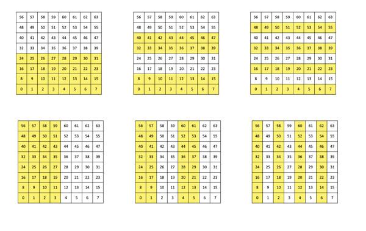

# ChessboardEscapeSolution

## Erläuterung zum „Impossible Chessboard Problem“

1.	Man kann „1“ oder „2“ zu Beginn des Programmseingeben:
bei „1“ wird ein Originalbeispiel für eine Nutzung der matplotlib gezeigt,
bei „2“ kommt man zur eigentlichen Aufgabe
 
2. Eine Lösung des eigentlichen Problems wird angegeben z.B. unter 
https://www.3blue1brown.com/lessons/chessboard-puzzle
und
https://github.com/3b1b/videos/blob/master/_2020/chess.py
## Aufgaben
1.	Führen Sie einen Vergleich der beiden Codes durch

2.	Ändern Sie den Code so, dass nur einmal eine zufällige Verteilung der Münzen gewählt wird und diese ab dann konstant ist

3.	Ändern Sie den Code so, dass die Verteilung der Münzen anstelle der zufälligen Verteilung über die Console eingegeben werden kann und dann konstant ist

4. Kann man die Klasse „SetVectors“ auch für andere Quadrate als 8x8 generisch erzeugen. Ein erster Versuch könnte ein 4x4 Brett sein wie in 
https://abz.inf.ethz.ch/wp-content/uploads/SK_Wehrle_Schachbrettraetsel.pdf 

# ChessboardEscapeSolution
# ChessboardEscapeSolution
